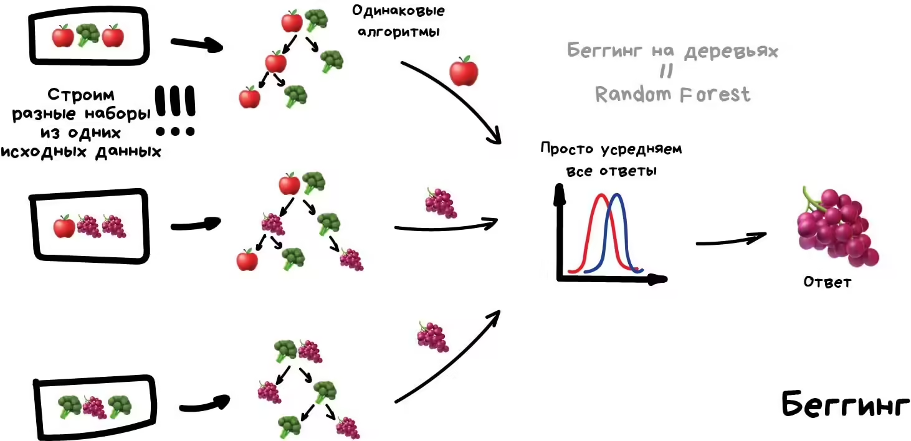
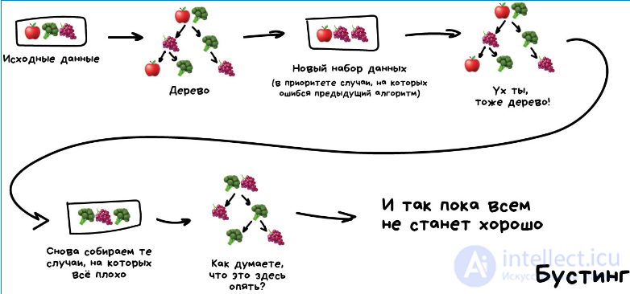

## Решaющие деревья (Decision Trees)

Представьте древовидную структуру, где каждый внутренний узел — это признак (feature), по которому принимается решение, каждая ветвь — результат условия (true/false), а каждый лист (leaf) — конечное предсказание или класс. Решающие деревья широко применяются для задач классификации и регрессии благодаря своей простоте и интерпретируемости.

Дерево решений строит набор правил "если-то" (if-then), последовательно разбивая объекты по признакам:

- Узел проверяет условие вида $x_j < t$, где $x_j$ — значение признака $j$, а $t$ — порог.
- Если условие истинно, переход к левому потомку, иначе к правому.
- Когда достигнут лист, выдается предсказание (класс или значение).

Обучение дерева означает поиск наилучшего признака и порога, минимизирующего меру неопределенности (impurity) в разбитых подмножествах. Для классификации используют критерии:

- Индекс Джини (Gini impurity):

$$
Gini = 1 - \sum_{k=1}^K p_{k}^2,
$$

где $p_k$ — доля класса $k$ в узле.

- Энтропия (Entropy):

$$
Entropy = - \sum_{k=1}^K p_k \log_2 p_k.
$$

Для регрессии часто применяют среднеквадратичную ошибку (MSE) как меру разброса значений внутри узла.

Метод рекурсивного построения дерева формально можно описать так: для каждого узла $m$ выбирается оптимальное разбиение $\theta = (j, t)$, где $j$ — индекс признака, а $t$ — порог, минимизирующее функцию потерь $H$:

$$
\theta^{*} = \arg\min_{\theta} \left[ \frac{n_{left}}{n_m} H(Q_{left}(\theta)) + \frac{n_{right}}{n_m} H(Q_{right}(\theta)) \right],
$$

где $Q_{left}(\theta), Q_{right}(\theta)$ — объекты, разделённые по условию, а $n_{left}, n_{right}, n_m$ — их количества в соответствующих узлах.

Переобучение — основное ограничение деревьев. Глубокое дерево может идеально подогнать обучающую выборку, но плохо работать на новых данных, т.к. слишком детализирует правила под шум. Чтобы избежать этого, применяются критерии остановки:

- Максимальная глубина дерева $max\_{depth}$
- Минимальное число объектов в листе $min\_{samples\_{leaf}}$
- Проверка чистоты узла (если все объекты одного класса, деление не нужно).

Дерево с глубиной 1 называют Decision Stump — простейшее «если-то» правило.

***

## Ансамблевые методы (Ensembles)

Ансамбли объединяют множество простых моделей (например, деревьев), чтобы улучшить качество предсказаний и устойчивость.

### Случайный лес (Random Forest)



Основная идея — обучить множество деревьев на случайных подвыборках данных и признаков, что снижает переобучение и повышает устойчивость. Итоговый прогноз — агрегирование (например, большинство голосов для классификации).

Преимущества:

- Снижает переобучение (ограничение влияния одного дерева)
- Работает стабильно и точно на разных данных
- Позволяет оценивать важность признаков (feature_importances_)

Минусы:

- Сложнее интерпретировать из-за множества деревьев
- Более высокие вычислительные затраты

Пример создания случайного леса в Python:

```python
from sklearn.ensemble import RandomForestClassifier
rf = RandomForestClassifier(n_estimators=100, max_depth=10, min_samples_leaf=3)
rf.fit(X_train, y_train)
```


***

### Градиентный бустинг (Gradient Boosting)


Это последовательное построение ансамбля, где каждая следующая модель обучается исправлять ошибки предыдущей. Минимизируется функция потерь через градиентный спуск по функциям потерь.

Идея:

$$
F_m(x) = F_{m-1}(x) + \gamma_m h_m(x),
$$

где $F_m$ — ансамбль на $m$-ом шаге, $h_m(x)$ — вновь обученная модель, $\gamma_m$ — коэффициент обновления.

Преимущества:

- Высокая точность, особенно на сложных задачах
- Гибкость выбора функции потерь
- Поддержка неполных данных и разных типов признаков

Минусы:

- Высокая вычислительная стоимость
- Чувствительность к переобучению при неправильной настройке
- Сложность интерпретации итоговой модели

Пример на Python:

```python
from sklearn.ensemble import GradientBoostingClassifier
gb = GradientBoostingClassifier(n_estimators=100, learning_rate=0.1)
gb.fit(X_train, y_train)
```


***

## Метрики качества (Metrics)

Для оценки качества моделей применяются разные метрики, в зависимости от задачи.

### Для классификации:

- Точность (Accuracy):

$$
Accuracy = \frac{TP + TN}{TP + TN + FP + FN}
$$

- Precision (точность положительных прогнозов):

$$
Precision = \frac{TP}{TP + FP}
$$

- Recall (полнота, чувствительность):

$$
Recall = \frac{TP}{TP + FN}
$$

- F1-мера — гармоническое среднее Precision и Recall:

$$
F1 = 2 \cdot \frac{Precision \cdot Recall}{Precision + Recall}
$$

- ROC AUC (Receiver Operating Characteristic — Area Under Curve):
ROC кривая показывает зависимость True Positive Rate (TPR, чувствительность) от False Positive Rate (FPR, доли ложноположительных результатов) при различных порогах классификации.

$$
TPR = \frac{TP}{TP + FN}, \quad FPR = \frac{FP}{FP + TN}
$$

AUC — площадь под ROC кривой, отражающая способность модели правильно ранжировать объекты: это вероятность, что случайный положительный пример будет оценен моделью выше случайного отрицательного. Значения AUC лежат в диапазоне от 0.5 (случайное угадывание) до 1 (идеальная модель).

ROC AUC важна тем, что не зависит от конкретного порога классификации и устойчива к дисбалансу классов. Эта метрика широко используется для сравнительной оценки бинарных классификаторов.

### Для регрессии:

- Среднеквадратичная ошибка (MSE):

$$
MSE = \frac{1}{N} \sum_{i=1}^N (y_i - \hat{y}_i)^2
$$

- Корень из MSE (RMSE)
- Средняя абсолютная ошибка (MAE)
- Коэффициент детерминации $R^2$:

$$
R^2 = 1 - \frac{\sum_{i=1}^N (y_i - \hat{y}_i)^2}{\sum_{i=1}^N (y_i - \bar{y})^2}
$$

***

## Итог

- Решающие деревья — простые и хорошо интерпретируемые, но склонны к переобучению и нестабильны.
- Случайный лес — устойчивый ансамбль деревьев, стабилизирующий предсказания и повышающий точность.
- Градиентный бустинг — мощный метод, обеспечивающий высокую точность, но требующий аккуратной настройки и вычислительных ресурсов.
- Метрики качества, помогают объективно оценить и сравнить модели в различных условиях.

